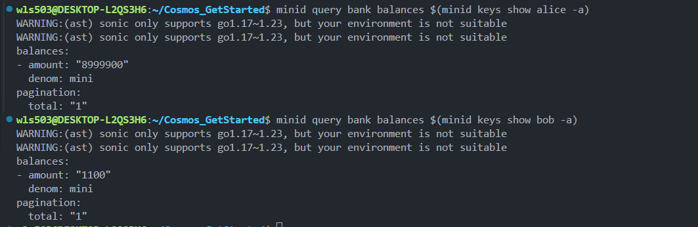
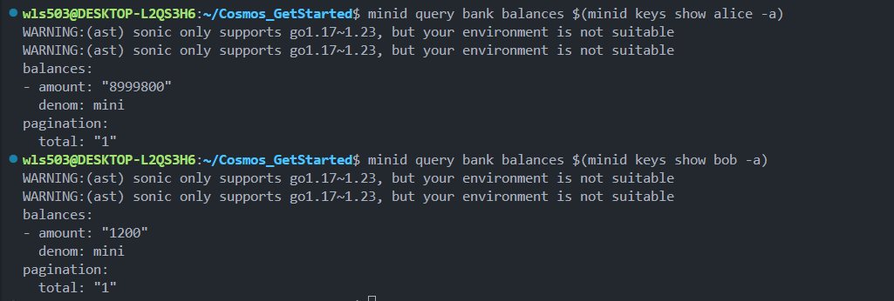
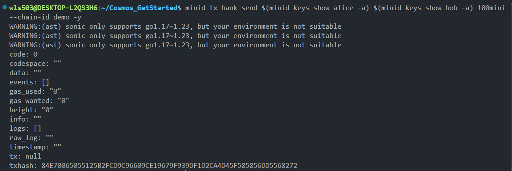

# How Cosmos SDK Bank Module Works: Complete Execution Flow

## Overview

This document explains how the bank module processes transactions in a Cosmos SDK blockchain, from CLI command execution through state persistence.

---

## Architecture: Components & Responsibilities

```
┌──────────────────────────────────────────────────────────┐
│                   COMPONENT RESPONSIBILITIES              │
└──────────────────────────────────────────────────────────┘

CLI (minid command)
├─ Parse transaction command
├─ Sign transaction with private key
└─ Broadcast to node

╔═════════════════════════════════════════════════════════════╗
║  MiniApp (app/app.go) - Your Application Logic             ║
╠═════════════════════════════════════════════════════════════╣
║                                                              ║
║  PHASE 1: CheckTx (Validate in Mempool)                     ║
║  ├─ AuthKeeper: Verify signature ✓                          ║
║  └─ BankKeeper: Check format ✓                              ║
║                                                              ║
║  PHASE 2: DeliverTx (Execute after block consensus)         ║
║  ├─ Route to bank module                                    ║
║  ├─ BankKeeper.SendCoins()                                  ║
║  │  ├─ Read balances from MultiStore                        ║
║  │  ├─ Update: sender -amount, receiver +amount             ║
║  │  └─ Write updated balances back                          ║
║  └─ Emit transfer event                                     ║
║                                                              ║
║  PHASE 3: Commit                                            ║
║  └─ Persist all changes to database                         ║
║                                                              ║
╚═════════════════════════════════════════════════════════════╝

CometBFT (Consensus Engine)
├─ Receive transaction from mempool
├─ Pack into block
├─ Run consensus (validators vote)
└─ Tell MiniApp to DeliverTx when block is final

MultiStore (Database)
├─ Stores all account balances
├─ Stores all blockchain state
└─ BankKeeper reads/writes here
```

---

## Step-by-Step Execution Flow

### 1. Start the Blockchain

```bash
minid start
```

**What happens:**

-   Loads `app/app.go` code → initializes `MiniApp` struct
-   Creates **AccountKeeper**, **BankKeeper**, **StakingKeeper**, etc.
-   Connects to **CometBFT** consensus engine
-   Starts the node on `localhost:26657`
-   Loads blockchain state from database

**Files involved:**

-   `app/app.go` - Application structure
-   `cmd/minid/main.go` - CLI entry point
-   `app/app.yaml` - Configuration (embedded in binary)

---

### 2. Query Account Balance (Before)

```bash
minid query bank balances <account-address>
```

**What happens:**

-   **Query module** calls **BankKeeper.GetBalance()**
-   **BankKeeper** reads from **MultiStore** (database)
-   Returns the value without changing state

**Code flow:**

```
CLI Query
  ↓
Query Router (in app.go)
  ↓
BankKeeper.GetBalance() [reads from MultiStore]
  ↓
Database lookup
  ↓
Return balance
```

---

### 3. Execute Transfer Transaction

```bash
minid tx bank send <from-address> <to-address> 100mini --chain-id demo -y
```

---

## Complete Transaction Lifecycle

```
┌─────────────────────────────────────────────────────────┐
│         Bank Transfer Execution Timeline                 │
└─────────────────────────────────────────────────────────┘

┌─ PHASE 1: CLIENT SIDE (Your Terminal)
│
├─ Step 1: CLI Parses Command
│  └─ Recognizes: bank.send from to amount
│
├─ Step 2: Sign Transaction
│  ├─ Creates MsgSend message
│  │  {FromAddress, ToAddress, Amount}
│  └─ Signs with sender's private key
│
└─ Step 3: Broadcast to Node
   └─ Sends signed tx to: http://localhost:26657

┌─ PHASE 2: NODE RECEIVES (minid start process)
│
├─ Step 4: CheckTx Validation
│  ├─ AuthKeeper validates signature ✅
│  ├─ BankKeeper checks format ✅
│  └─ Add to Mempool (waiting queue)
│
├─ Step 5: CometBFT Consensus
│  ├─ Validators pack transaction into block
│  └─ 2/3 validators vote: APPROVED ✅
│
└─ Step 6: DeliverTx Execution
   ├─ Decode transaction
   ├─ Route to bank module handler
   │
   └─ BankKeeper.SendCoins() EXECUTES:
      ├─ Read sender's balance
      ├─ Subtract amount
      ├─ Write back to MultiStore
      │
      ├─ Read receiver's balance
      ├─ Add amount
      ├─ Write back to MultiStore
      │
      └─ Emit event: "transfer"

├─ Step 7: Commit to Database
│  ├─ All state changes saved to disk
│  └─ Transaction FINALIZED ✅
│
└─ Return tx hash
```

---

## Code Execution Map

### File: `app/app.go`

```go
// MiniApp struct (defined in app.go)
type MiniApp struct {
    *runtime.App

    // These are initialized when "minid start" runs:
    AccountKeeper  authkeeper.AccountKeeper
    BankKeeper     bankkeeper.Keeper          // ← Handles transfers
    StakingKeeper  *stakingkeeper.Keeper
    DistrKeeper    distrkeeper.Keeper
    ConsensusParamsKeeper consensuskeeper.Keeper
}

// NewMiniApp() is called when minid starts
func NewMiniApp(...) *MiniApp {
    app := &MiniApp{}

    // Dependency injection initializes all Keepers
    depinject.Inject(
        &app.AccountKeeper,      // For signature verification
        &app.BankKeeper,         // For balance management ← Key!
        // ...
    )

    return app
}
```

**When to execute:** `minid start`

---

### File: Bank Module Handler

```go
// In bank module (cosmos-sdk/x/bank)

type MsgSend struct {
    FromAddress string
    ToAddress   string
    Amount      []Coin
}

// Handler function (executes in DeliverTx phase)
func (k BankKeeper) SendCoins(ctx Context, from, to Address, amount Coins) error {

    // Step A: Read from MultiStore
    fromBalance := k.GetBalance(ctx, from, "mini")

    // Step B: Validate
    if fromBalance < amount {
        return error("insufficient funds")
    }

    // Step C: Modify state
    toBalance := k.GetBalance(ctx, to, "mini")

    k.SetBalance(ctx, from, fromBalance - amount)
    k.SetBalance(ctx, to, toBalance + amount)

    // Step D: Emit event
    k.EmitEvent(ctx, "transfer", {from, to, amount})

    return nil
}
```

**When to execute:** During `DeliverTx` phase (after block consensus)

---

## State Change Example

```
BEFORE Transaction:
┌─────────────────────────┐
│   Accounts (MultiStore) │
├─────────────────────────┤
│ alice: 8999900 mini     │
│ bob:   1100 mini        │
└─────────────────────────┘

DURING DeliverTx:
┌──────────────────────────────────────┐
│  BankKeeper.SendCoins(alice→bob 100) │
├──────────────────────────────────────┤
│ 1. Read alice: 8999900               │
│ 2. Read bob: 1100                    │
│ 3. Compute:                          │
│    alice: 8999900 - 100 = 8999800    │
│    bob: 1100 + 100 = 1200            │
│ 4. Write alice: 8999800              │
│ 5. Write bob: 1200                   │
└──────────────────────────────────────┘
        ↓
AFTER Transaction (Committed):
┌─────────────────────────┐
│   Accounts (MultiStore) │
├─────────────────────────┤
│ alice: 8999800 mini     │
│ bob:   1200 mini        │
└─────────────────────────┘

Data saved to disk ✓
Transaction finalized ✓
```

---

## Practical Example: Alice Sends 100 Mini to Bob

### Step 1: Check Balance Before Transfer

```bash
minid query bank balances $(minid keys show alice -a)
```

**Output:**

```
balances:
- amount: "8999900"
  denom: mini
```

```bash
minid query bank balances $(minid keys show bob -a)
```

**Output:**

```
balances:
- amount: "1100"
  denom: mini
```

### Step 2: Execute Transfer

```bash
$ minid tx bank send $(minid keys show alice -a) $(minid keys show bob -a) 100mini \
  --chain-id demo -y
```

**Output:**

```
code: 0
gas_used: "0"
gas_wanted: "0"
txhash: 84E700650551...
```

### Step 3: Check Balance After Transfer

```bash
minid query bank balances $(minid keys show alice -a)
```

**Output:**

```
balances:
- amount: "8999800"        ← Decreased by 100
  denom: mini
```

```bash
minid query bank balances $(minid keys show bob -a)
```

**Output:**

```
balances:
- amount: "1200"           ← Increased by 100
  denom: mini
```

---

## Files & Modules Involved

| Component         | File/Location       | Responsibility                           |
| ----------------- | ------------------- | ---------------------------------------- |
| **App**           | `app/app.go`        | Initializes Keepers, handles ABCI phases |
| **Params**        | `app/params/`       | Encoding configuration                   |
| **BankKeeper**    | SDK library         | Manages account balances                 |
| **AccountKeeper** | SDK library         | Manages account info                     |
| **Bank Module**   | SDK library         | Routes MsgSend to handler                |
| **MultiStore**    | Database            | Persists all state                       |
| **CometBFT**      | External            | Consensus & block creation               |
| **CLI**           | `cmd/minid/main.go` | User interface                           |

---

**Visual Evidence:**

-    - Initial state
-    - Final state
-    - Transaction execution

---

## Key Takeaway

```
The entire bank transfer is orchestrated by:

1. CLI Command
   → Parses and signs the transaction

2. MiniApp (app/app.go)
   → Validates (CheckTx) and executes (DeliverTx)

3. BankKeeper
   → Performs the actual balance transfer

4. MultiStore
   → Persists the new state to database

Result: Transfer successful ✓
```

**The bank module separates concerns:**

-   **Business logic** (app/app.go)
-   **Balance management** (BankKeeper)
-   **Consensus** (CometBFT)
-   **Storage** (MultiStore)

This clean separation makes the system modular, testable, and scalable.
