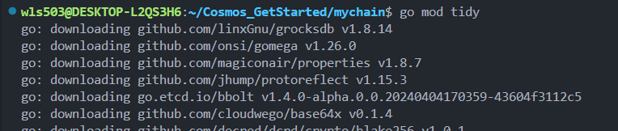
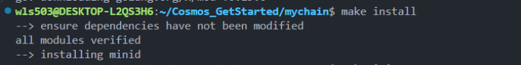
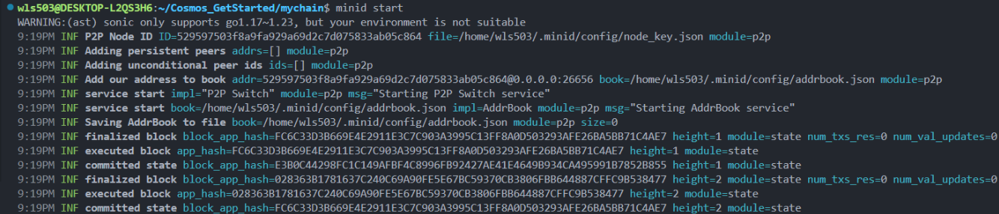

# MyChain - Cosmos SDK Minimal Blockchain

A lightweight Cosmos SDK blockchain learning project based on `cosmosregistry/chain-minimal`.

This is a small but fully functional Cosmos SDK chain example that uses the minimal set of modules, designed as a starting point for building your own blockchain while **avoiding unnecessary boilerplate code from other tools**.

## Project Overview

**Core Modules Included:**

-   ✅ Account Management (auth)
-   ✅ Token Transfer (bank)
-   ✅ Staking System (staking)
-   ✅ Reward Distribution (distribution)
-   ✅ Token Minting (mint)

**Project Advantages:**

-   Lightweight (no unnecessary boilerplate)
-   Fully functional (can start, query, and transact)
-   Easy to extend (can add custom modules)

---

## Quick Start

### Prerequisites

-   Go 1.17 to 1.23

### Installation Steps

#### Step 1: Add Dependencies

```bash
cd mychain
go mod tidy
```



#### Step 2: Compile and Install

```bash
make install
```



Verify installation:

```bash
which minid
minid version
```

#### Step 3: Initialize the Chain

```bash
make init
```

This will:

-   Generate genesis account
-   Initialize configuration files
-   Create `.minid` directory

#### Step 4: Start the Chain

```bash
minid start
```



**Signs of successful startup:**

-   ✅ P2P Node is running
-   ✅ Address book added
-   ✅ Blocks executed
-   ✅ State committed

---

## Verify Chain Status

While the chain is running, **open a new terminal** and run:

```bash
curl http://localhost:26657/status
```

**The returned JSON proves:**

-   ✅ Tendermint RPC is running
-   ✅ Chain is producing blocks (`"latest_block_height"` increases)
-   ✅ Chain is healthy

---

## Core Architecture

### Application Flow

**When executing `minid start`:**

```
1. main.go initialization
   ├─ Set address prefix
   ├─ Create CLI instance

2. app.go creates application
   ├─ Initialize AccountKeeper
   ├─ Initialize BankKeeper
   ├─ Initialize StakingKeeper
   ├─ Initialize DistrKeeper
   └─ Initialize ConsensusParamsKeeper

3. Chain startup
   ├─ Load genesis state
   ├─ Start Tendermint consensus
   └─ Begin block production
```

### Key Components

**app/app.go** - Main application definition that registers all modules and their Keepers

**cmd/minid/main.go** - Command-line entry point that initializes and executes blockchain commands

**x/ Directory** - Location for custom modules (currently empty, ready for extensions)

---

## Common Commands

### Chain Operations

```bash
# Start the chain
minid start

# Check chain status (in another terminal)
curl http://localhost:26657/status

# Query REST API
curl http://localhost:1317/cosmos/bank/v1beta1/supply
```

### Account Operations

```bash
# List existing accounts
minid keys list

# Create new account
minid keys add myaccount

# Query account balance
minid query bank balances $(minid keys show -a default)
```

### Transaction Operations

```bash
# Send transfer transaction
minid tx bank send default <recipient_address> 1000stake --chain-id demo

# Query transaction history
minid query tx <tx_hash>
```

---

## Extending the Project

### Add Custom Module

Create a new module in the `x/` directory, then register it in `app/app.go`.

**Example structure:**

```
x/counter/
├── keeper.go      # State management
├── types.go       # Data structures
└── module.go      # Module definition
```

---

## Tech Stack

-   **Cosmos SDK:** v0.50.x
-   **Tendermint:** BFT consensus engine
-   **Protocol Buffers:** Message serialization

---

## Resources

-   [Cosmos SDK Documentation](https://docs.cosmos.network/)
-   [chain-minimal Repository](https://github.com/cosmosregistry/chain-minimal)
-   [Tendermint](https://tendermint.com/)
